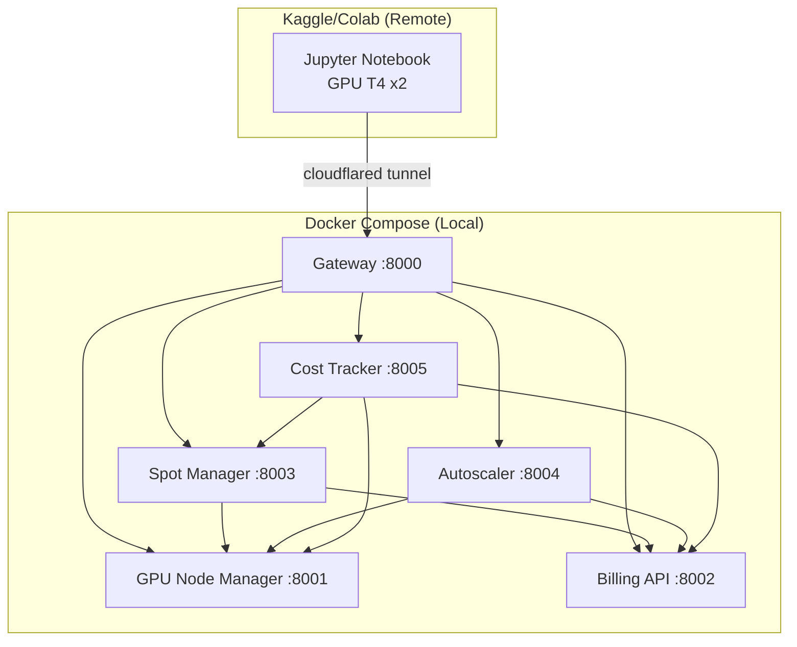

# Hướng Dẫn Cài Đặt & Chạy Lab — GPU FinOps & Cost Optimization trên Ubuntu

> 📅 Ngày: 13 Tháng 5, 2026  
> 🎯 Mục tiêu: Mô phỏng quy trình FinOps cho GPU Cluster — Monitoring, Billing, Spot Instance, Autoscaling, Cost Analysis

---

## Mục lục

1. [Tổng quan dự án (Project Overview)](#1-tổng-quan-dự-án)
2. [Yêu cầu hệ thống (Requirements)](#2-yêu-cầu-hệ-thống)
3. [Kiến trúc ứng dụng](#3-kiến-trúc-ứng-dụng)
4. [Những việc cần làm (Todo List)](#4-những-việc-cần-làm)
5. [Hướng dẫn cài đặt chi tiết](#5-hướng-dẫn-cài-đặt-chi-tiết)
6. [Các lệnh Docker Compose](#6-các-lệnh-docker-compose)
7. [API Endpoints](#7-api-endpoints)
8. [Cấu trúc thư mục nộp bài](#8-cấu-trúc-thư-mục-nộp-bài)
9. [Troubleshooting](#9-troubleshooting)

---

## 1. Tổng quan dự án

**GPU FinOps Lab** là một bài lab hands-on mô phỏng toàn bộ quy trình **FinOps (Cloud Financial Operations)** cho GPU Cluster trên cloud. Dự án bao gồm:

### Backend (Local — Docker Compose)
6 microservices Python (FastAPI) chạy trong container:
| Service | Port | Mô phỏng |
|---------|------|----------|
| **Gateway** | `:8000` | API Gateway — đầu vào duy nhất cho notebook |
| **GPU Node Manager** | `:8001` | Cluster GPU đa node (T4, A100, V100) |
| **Billing API** | `:8002` | Hệ thống tính phí cloud (on-demand & spot) |
| **Spot Manager** | `:8003` | Spot/preemptible instance bidding & preemption |
| **Autoscaler** | `:8004` | KEDA-like autoscaler (scale up/down dựa trên utilization) |
| **Cost Tracker** | `:8005` | OpenCost-like — cost allocation, waste analysis, recommendations |

### Frontend (Remote — Kaggle / Google Colab)
- Jupyter Notebook (`notebook/gpu_finops_lab.ipynb`) chạy trên Kaggle với **GPU T4 x2** thật
- Notebook kết nối tới local services qua tunnel (cloudflared/ngrok)
- Gồm **8.5 parts**: Monitoring → Billing → Spot → Autoscaling → Cost Analysis → Visualization → Full Workflow → Real GPU Training → Advanced Analysis

### Kết nối
```
LOCAL (Docker)                          REMOTE (Kaggle/Colab)
┌─────────────────────────┐            ┌──────────────────────┐
│ gpu-node-manager :8001  │            │                      │
│ billing-api      :8002  │◄──tunnel──►│  Jupyter Notebook    │
│ spot-manager     :8003  │            │  (GPU workload +     │
│ autoscaler       :8004  │            │   visualization)     │
│ cost-tracker     :8005  │            │                      │
│ gateway          :8000  │            └──────────────────────┘
└─────────────────────────┘
```

---

## 2. Yêu cầu hệ thống

### 2.1. Yêu cầu bắt buộc

| Thành phần | Phiên bản tối thiểu | Ghi chú |
|------------|---------------------|---------|
| **Ubuntu** | 20.04 / 22.04 / 24.04 | Hệ điều hành |
| **Docker Engine** | 24.x+ | Cài từ apt hoặc docker.com |
| **Docker Compose Plugin** | v2.20+ | `docker compose` (có plugin) |
| **Tài khoản Kaggle** | — | Miễn phí tại https://kaggle.com |
| **Internet** | — | Để tải images, tunnel, Kaggle |

### 2.2. Yêu cầu khuyến nghị

| Thành phần | Ghi chú |
|------------|---------|
| **cloudflared** | Tunnel miễn phí, không cần tài khoản |
| **curl** | Test API endpoints |
| **Git** | Clone project (nếu cần) |

### 2.3. Yêu cầu không bắt buộc

| Thành phần | Ghi chú |
|------------|---------|
| Python local | **Không cần** — services chạy trong Docker |
| GPU local | **Không cần** — GPU training chạy trên Kaggle |

---

## 3. Kiến trúc ứng dụng

### 3.1. Sơ đồ services



### 3.2. Luồng dữ liệu

1. Notebook gửi request qua tunnel → Gateway (`:8000`)
2. Gateway route request tới service tương ứng
3. Các service xử lý và trả dữ liệu mô phỏng
4. Notebook vẽ biểu đồ, phân tích cost, đưa recommendations

---

## 4. Những việc cần làm

### Phase 1: Chuẩn bị môi trường Ubuntu

- [ ] **1.1.** Cài đặt Docker Engine
- [ ] **1.2.** Cấu hình Docker không cần sudo
- [ ] **1.3.** Cài đặt Docker Compose plugin
- [ ] **1.4.** Cài đặt cloudflared (tunnel)
- [ ] **1.5.** Kiểm tra curl, git

### Phase 2: Chạy services local

- [ ] **2.1.** Build & start Docker services
- [ ] **2.2.** Kiểm tra tất cả services hoạt động
- [ ] **2.3.** Test API endpoints

### Phase 3: Mở tunnel

- [ ] **3.1.** Chạy cloudflared tunnel
- [ ] **3.2.** Copy tunnel URL

### Phase 4: Chuẩn bị Kaggle

- [ ] **4.1.** Đăng nhập https://kaggle.com
- [ ] **4.2.** Tạo notebook mới
- [ ] **4.3.** Upload `notebook/gpu_finops_lab.ipynb`
- [ ] **4.4.** Bật Accelerator → GPU T4 x2
- [ ] **4.5.** Paste tunnel URL vào cell 2

### Phase 5: Chạy notebook & thu thập kết quả

- [ ] **5.1.** Điền Student Name + ID (Cell 2.5)
- [ ] **5.2.** Chạy lần lượt các cells từ Part 1 → Part 8.5
- [ ] **5.3.** Chụp screenshot từng phần (kèm header)
- [ ] **5.4.** Lưu generated charts (`*.png`)

### Phase 6: Nộp bài

- [ ] **6.1.** Tạo thư mục nộp bài đúng cấu trúc
- [ ] **6.2.** Copy screenshots, charts, notebook vào thư mục
- [ ] **6.3.** Kiểm tra đầy đủ các file theo SUBMISSION.md

---

## 5. Hướng dẫn cài đặt chi tiết

### 5.1. Cài Docker Engine

```bash
# Cập nhật package list
sudo apt update
sudo apt upgrade -y

# Cài các package cần thiết
sudo apt install -y ca-certificates curl gnupg lsb-release

# Thêm Docker GPG key
sudo install -m 0755 -d /etc/apt/keyrings
curl -fsSL https://download.docker.com/linux/ubuntu/gpg | sudo gpg --dearmor -o /etc/apt/keyrings/docker.gpg
sudo chmod a+r /etc/apt/keyrings/docker.gpg

# Thêm Docker repository
echo \
  "deb [arch=$(dpkg --print-architecture) signed-by=/etc/apt/keyrings/docker.gpg] https://download.docker.com/linux/ubuntu \
  $(lsb_release -cs) stable" | sudo tee /etc/apt/sources.list.d/docker.list > /dev/null

# Cài Docker Engine + Compose plugin
sudo apt update
sudo apt install -y docker-ce docker-ce-cli containerd.io docker-buildx-plugin docker-compose-plugin

# Kiểm tra
sudo docker run hello-world
```

### 5.2. Cấu hình Docker không cần sudo

```bash
# Thêm user vào group docker
sudo usermod -aG docker $USER

# Kiểm tra group
groups $USER

# QUAN TRỌNG: Đăng xuất và đăng nhập LẠI để thay đổi có hiệu lực
# Hoặc chạy lệnh sau (tạm thời):
newgrp docker

# Kiểm tra (không cần sudo)
docker info
```

### 5.3. Kiểm tra Docker Compose

```bash
docker compose version
# Kết quả: Docker Compose version v2.x.x
```

### 5.4. Cài cloudflared (tunnel)

```bash
# Cách 1: Download .deb trực tiếp
curl -L https://github.com/cloudflare/cloudflared/releases/latest/download/cloudflared-linux-amd64.deb -o /tmp/cloudflared.deb
sudo dpkg -i /tmp/cloudflared.deb

# Cách 2: Hoặc dùng binary
curl -L https://github.com/cloudflare/cloudflared/releases/latest/download/cloudflared-linux-amd64 -o /tmp/cloudflared
sudo install -m 755 /tmp/cloudflared /usr/local/bin/

# Kiểm tra
cloudflared --version
```

### 5.5. Clone project (nếu chưa có)

```bash
# Di chuyển đến thư mục làm việc
cd ~/Documents/VINAI/Track2/

# Nếu project đã có sẵn, chỉ cần cd vào
cd Day25-Lab-GPU-FinOps-Cost_Optimization

# Xem cấu trúc
ls -la
```

---

## 6. Các lệnh Docker Compose

### 6.1. Build & Start services

```bash
cd ~/Documents/VINAI/Track2/Day25-Lab-GPU-FinOps-Cost_Optimization

# Cách 1: Dùng run-linux.sh script (khuyến nghị)
./run-linux.sh start

# Cách 2: Dùng docker compose trực tiếp
docker compose up --build -d
```

> **Lần đầu:** Build ~2-3 phút (tải Python images, cài dependencies)  
> **Lần sau:** ~5 giây

### 6.2. Kiểm tra services

```bash
# Xem tất cả containers đang chạy
docker compose ps

# Test gateway
curl http://localhost:8000/

# Hoặc dùng script test
./run-linux.sh test
```

Kết quả mong đợi:
```
[OK] GET /
[OK] GET /cluster/nodes
[OK] GET /cluster/metrics
[OK] GET /billing/pricing
[OK] GET /spot/pricing
[OK] GET /autoscaler/policy
[OK] GET /cost/dashboard
```

### 6.3. Mở tunnel

```bash
# Trong terminal riêng hoặc cùng terminal
./run-linux.sh tunnel
```

Kết quả:
```
==========================================
 TUNNEL ACTIVE
==========================================
  URL: https://<random>.trycloudflare.com
```

> Copy URL này để paste vào notebook.

### 6.4. Xem logs

```bash
# Tất cả services
./run-linux.sh logs

# Một service cụ thể
./run-linux.sh logs gateway
./run-linux.sh logs gpu-node-manager

# Docker compose trực tiếp
docker compose logs -f --tail=100
```

### 6.5. Dừng services

```bash
# Dùng script (sẽ stop cả tunnel)
./run-linux.sh stop

# Docker compose
docker compose down
```

### 6.6. Các lệnh hữu ích khác

```bash
# Xem trạng thái
./run-linux.sh status

# Test tất cả endpoints
./run-linux.sh test

# Restart một service
docker compose restart gateway

# Xem resource usage
docker stats
```

---

## 7. API Endpoints

Tất cả API đều qua Gateway tại `http://localhost:8000`.

### Cluster & GPU Nodes

| Method | Endpoint | Mô tả |
|--------|----------|-------|
| `GET` | `/` | Thông tin gateway |
| `GET` | `/cluster/nodes` | Danh sách tất cả GPU nodes |
| `GET` | `/cluster/metrics` | Metrics tổng hợp (utilization, memory, power) |
| `POST` | `/cluster/workloads/submit` | Submit workload mới |
| `GET` | `/cluster/workloads` | Danh sách workloads |
| `POST` | `/cluster/workloads/{id}/complete` | Kết thúc workload |
| `POST` | `/cluster/scale-up?gpu_type=T4&count=1` | Thêm nodes |

### Billing

| Method | Endpoint | Mô tả |
|--------|----------|-------|
| `GET` | `/billing/pricing` | Bảng giá GPU (on-demand & spot) |
| `POST` | `/billing/record` | Ghi nhận billing event |
| `GET` | `/billing/summary?project=default` | Tổng hợp chi phí |
| `GET` | `/billing/forecast?hours_ahead=24` | Dự báo chi phí |
| `POST` | `/billing/budget` | Thiết lập ngân sách |

### Spot Instances

| Method | Endpoint | Mô tả |
|--------|----------|-------|
| `GET` | `/spot/pricing` | Giá spot hiện tại (có biến động) |
| `POST` | `/spot/request` | Request spot instance |
| `GET` | `/spot/instances` | Danh sách spot instances |
| `POST` | `/spot/simulate-preemption` | Mô phỏng preemption |
| `GET` | `/spot/savings-report` | Báo cáo tiết kiệm |

### Autoscaler

| Method | Endpoint | Mô tả |
|--------|----------|-------|
| `GET` | `/autoscaler/policy` | Chính sách scaling hiện tại |
| `POST` | `/autoscaler/policy` | Cập nhật policy |
| `POST` | `/autoscaler/evaluate` | Kích hoạt evaluation |
| `GET` | `/autoscaler/history` | Lịch sử scaling decisions |

### Cost Tracker

| Method | Endpoint | Mô tả |
|--------|----------|-------|
| `POST` | `/cost/snapshot` | Chụp snapshot chi phí |
| `GET` | `/cost/allocations` | Cost allocation history |
| `GET` | `/cost/waste-report` | Báo cáo waste (idle GPUs) |
| `POST` | `/cost/recommendations` | Tạo recommendations |
| `GET` | `/cost/dashboard` | Dashboard tổng hợp |

---

## 8. Cấu trúc thư mục nộp bài

Tạo thư mục nộp bài theo mẫu sau (tham khảo `SUBMISSION.md`):

```
[StudentName]_GPU_FinOps_Submission/
├── report.pdf                          # Báo cáo phân tích (nếu có)
├── screenshots/
│   ├── part1_cluster_monitoring.png    # Cell 3
│   ├── part1_cluster_metrics.png       # Cell 4
│   ├── part2_workload_submission.png   # Cell 5
│   ├── part2_billing_summary.png       # Cell 6
│   ├── part3_spot_pricing.png          # Cell 7
│   ├── part3_spot_request.png          # Cell 8
│   ├── part3_spot_preemption.png       # Cell 9
│   ├── part4_autoscaler_policy.png     # Cell 10
│   ├── part4_autoscaler_evaluation.png # Cell 11
│   ├── part5_cost_snapshots.png        # Cell 12
│   ├── part5_waste_report.png          # Cell 13
│   ├── part5_recommendations.png       # Cell 14
│   ├── part5_dashboard.png             # Cell 15
│   ├── part6_cost_breakdown_viz.png    # Cell 16
│   ├── part6_timeseries_viz.png        # Cell 17
│   ├── part7_full_workflow.png         # Cell 18
│   ├── part8_gpu_detection.png         # Cell 19
│   ├── part8_gpu_metrics_diagnostic.png# Cell 20
│   ├── part8_fp32_summary.png          # Cell 22
│   ├── part8_amp_summary.png           # Cell 23
│   ├── part8_fp32_vs_amp_comparison.png# Cell 24
│   ├── part8_real_gpu_cost_report.png  # Cell 25
│   ├── part85_multi_gpu_analysis.png   # Cell 27
│   ├── part85_project_forecast.png     # Cell 28
│   ├── part85_optimization_analysis.png# Cell 29
│   ├── part85_integrated_dashboard.png # Cell 30
│   └── part85_challenge_strategy.png   # Cell 31
├── generated_charts/
│   ├── finops_cost_breakdown.png
│   ├── finops_timeseries.png
│   ├── real_gpu_comparison.png
│   ├── real_gpu_telemetry.png
│   ├── cost_per_epoch.png
│   ├── multi_gpu_scaling.png
│   ├── project_forecast.png
│   ├── optimization_roadmap.png
│   └── advanced_finops_dashboard.png
└── notebook/
    └── gpu_finops_lab.ipynb            # Đã chạy hoàn chỉnh
```

---

## 9. Troubleshooting

### Docker không chạy

```bash
# Kiểm tra Docker daemon
sudo systemctl status docker

# Start Docker
sudo systemctl start docker

# Enable Docker tự động start khi boot
sudo systemctl enable docker

# Nếu vẫn lỗi, kiểm tra log
sudo journalctl -u docker -n 50 --no-pager
```

### Permission denied khi chạy Docker

```bash
# Lỗi: permission denied while trying to connect to the Docker daemon socket
# Nguyên nhân: chưa add user vào group docker
sudo usermod -aG docker $USER

# Áp dụng ngay (không cần logout)
newgrp docker
```

### Port đã bị chiếm

```bash
# Kiểm tra port 8000
sudo ss -tlnp | grep :8000
# hoặc
sudo lsof -i :8000

# Kill process đang giữ port
sudo kill -9 <PID>

# Hoặc đổi port trong docker-compose.yml
```

### Tunnel không hoạt động

```bash
# Kiểm tra tunnel log
cat .tunnel.log

# Chạy cloudflared thủ công để thấy log realtime
cloudflared tunnel --url http://localhost:8000

# Kiểm tra gateway local còn chạy không
curl http://localhost:8000/

# Nếu URL thay đổi, cập nhật lại trong notebook
```

### Kaggle không kết nối được

```bash
# 1. Kiểm tra tunnel còn active
./run-linux.sh status

# 2. Kiểm tra gateway từ local
curl http://localhost:8000/cluster/nodes

# 3. Kiểm tra gateway qua tunnel (thay URL của bạn)
curl https://your-subdomain.trycloudflare.com/cluster/nodes

# 4. Đảm bảo notebook dùng đúng URL
# GATEWAY_URL = "https://your-subdomain.trycloudflare.com"
```

### Container liên tục restart

```bash
# Xem log của service bị lỗi
docker compose logs gpu-node-manager

# Restart service
docker compose restart gpu-node-manager

# Rebuild từ đầu
docker compose up --build -d
```

### Quên không stop tunnel

```bash
# Tunnel process vẫn chạy ngầm
# Dùng script để stop (sẽ kill tunnel)
./run-linux.sh stop

# Hoặc kill thủ công
kill $(cat .tunnel.pid) 2>/dev/null || true
rm -f .tunnel.pid
```

### Docker chiếm nhiều disk

```bash
# Xem dung lượng Docker đang dùng
docker system df

# Clean containers/images không dùng
docker system prune -a --volumes

# Xóa specific images
docker rmi $(docker images -q)
```

---

## Phụ lục: Cheatsheet nhanh

```bash
# ===== START =====
cd ~/Documents/VINAI/Track2/Day25-Lab-GPU-FinOps-Cost_Optimization
./run-linux.sh start

# ===== TEST =====
./run-linux.sh test

# ===== TUNNEL =====
./run-linux.sh tunnel
# Copy URL -> paste vào Kaggle notebook

# ===== STOP =====
./run-linux.sh stop

# ===== LOGS =====
./run-linux.sh logs gateway

# ===== DOCKER COMPOSE =====
docker compose ps          # Xem trạng thái
docker compose logs -f     # Xem logs realtime
docker compose down        # Dừng tất cả
docker compose up -d       # Start ngầm
docker compose restart X   # Restart service X
```

---

> 📝 **Lưu ý quan trọng:**
> - Trong mọi screenshot, phải scroll lên để header thông tin sinh viên (Cell 2.5) hiển thị ở đầu màn hình
> - Tunnel URL thay đổi mỗi lần chạy cloudflared → phải copy URL mới
> - Part 8 cần chạy trên Kaggle/Colab với GPU enabled
> - Nộp notebook với tất cả outputs đã chạy (không clear)
